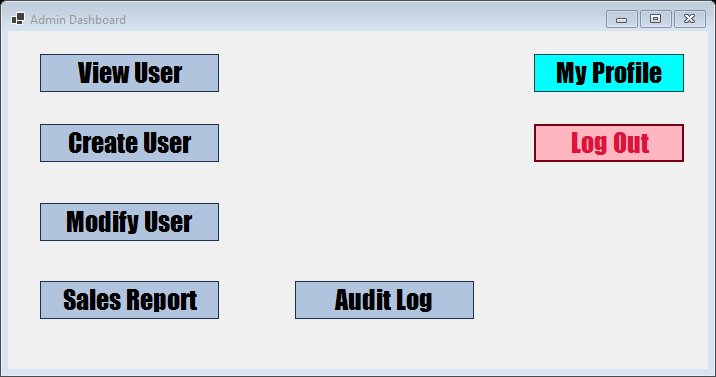
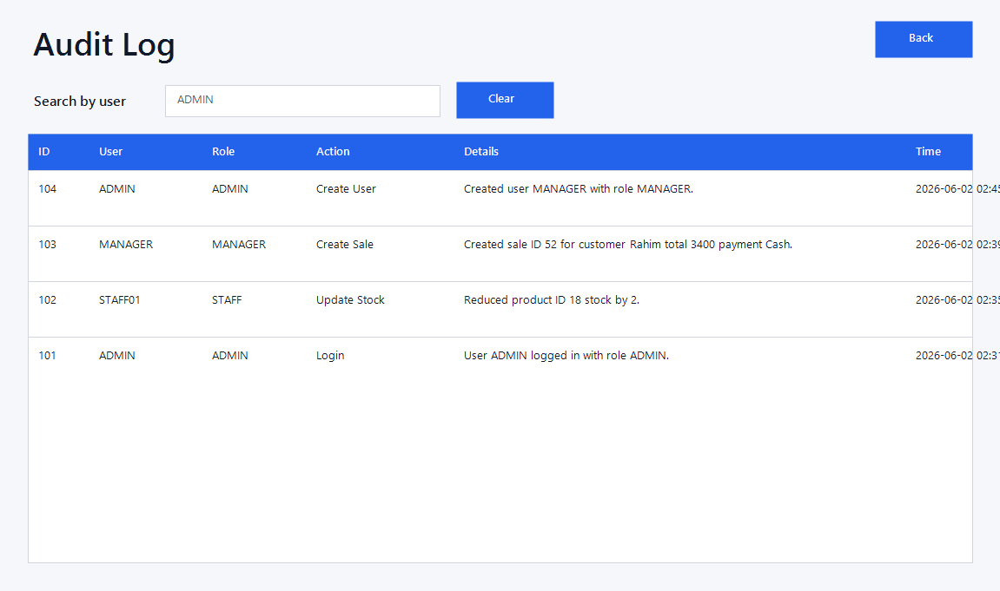

# StoreInventoryPos

StoreInventoryPos is a Windows Forms point-of-sale and inventory management application for retail store operations. It supports role-based dashboards, inventory tracking, sales processing, refund management, reporting, and audit logging.

## Screenshots

### Admin Dashboard



### Audit Log



## Features

- Role-based access for Admin, Manager, and Staff users.
- Inventory management for products, price, cost, size, quantity, and profit tracking.
- Sales workflow with cart selection, promo code validation, payment type, and stock deduction.
- Refund management with sale-to-refund linking.
- Sales and refund reports with search and PDF export.
- Audit log for user activity, including login, logout, user changes, product changes, promo changes, sales, stock updates, and refunds.
- Secure password storage using PBKDF2 hashing.
- Configurable SQL Server connection string through `STORE_POS_CONNECTION_STRING`.

## Technology Stack

- C#
- .NET 8 Windows Forms
- Microsoft SQL Server
- ADO.NET with `Microsoft.Data.SqlClient`
- iTextSharp for PDF export

## Database

The application expects a SQL Server database named `ShoeStorePOS` by default.

Default connection:

```text
Data Source=.\SQLEXPRESS;Initial Catalog=ShoeStorePOS;Integrated Security=True;Trust Server Certificate=True;
```

To use another server or login, set:

```powershell
$env:STORE_POS_CONNECTION_STRING="Data Source=YOUR_SERVER;Initial Catalog=ShoeStorePOS;Integrated Security=True;Trust Server Certificate=True;"
```

## Default Development Users

```text
Username: ADMIN
Password: ADMIN
Role: ADMIN
```

```text
Username: MANAGER
Password: MANAGER
Role: MANAGER
```

Passwords are stored as hashes in the database.

## Build

```powershell
dotnet build StoreInventoryPos.sln
```

## Run

Build the project, then run:

```powershell
.\Run.bat
```

You can also start the application from Visual Studio using `StoreInventoryPos.sln`.
